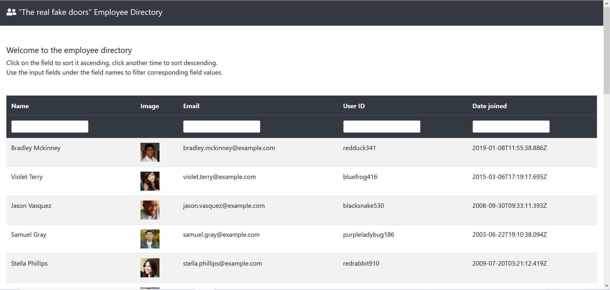
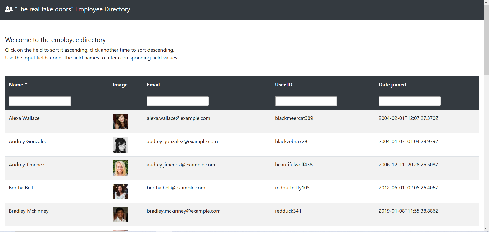
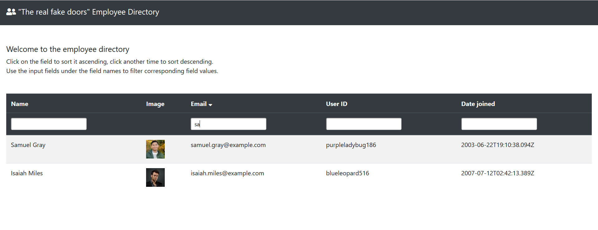

This project was bootstrapped with [Create React App](https://github.com/facebook/create-react-app).

## Employee Directory

This is a small one-page application built with React. The application shows a list of employees in a table format. For the purposes of this application, the data is received from the external API using axios library. 

The application allows a user to view the list of employees, and sort and filter the view.

When a user clicks on any field name (except Image), the table will be sorted in ascending order by that field. If the user clicks the same field again, the table will be sorted in descending order by the same field. Should the user click on a different field name, the sorting will be applied to the new field. 

The filtering is done by inputing the desired search string in the input field under each field name (except Image). Multiple fields can be filtered at the same time. Filtering and sorting can be applied at the same time. 

## Application View

## Sorting 

## Sorting and Filtering

## Deployed Application: 
https://kv-react-employee-directory.herokuapp.com
